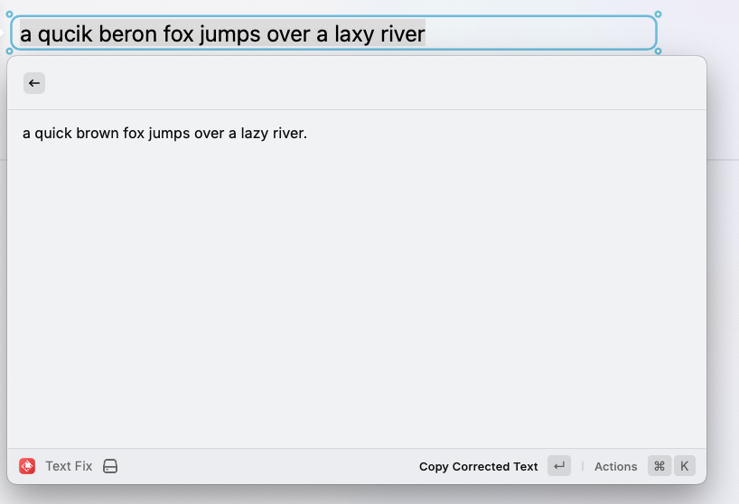

# **Text Fixer - Raycast Extension**  

**Text Fixer Corrector** is a **Raycast extension** that automatically corrects spelling and grammar errors while preserving the original meaning and formatting of the input text. It leverages the **gnokit/improve-grammar** LLM model for accurate and efficient text corrections.  

## ✨ Features  
- ✅ **Spelling & Grammar Fixes** – Corrects errors with high accuracy  
- 🔄 **Preserves Formatting** – Maintains original structure and layout  
- 🔍 **Retains Original Meaning** – No unintended changes to content  
- ⚡ **Seamless Raycast Integration** – Works instantly within Raycast  
- 🧠 **Powered by gnokit/improve-grammar** – High-quality LLM-based corrections  

## 📷 Screenshot

## 🎯 Shortcuts  
- **`Alt + F`** → Trigger correction on selected text  
- **`Enter`** → Copy corrected text  
- **`Cmd + Enter`** → Insert corrected text  

## 🚀 How It Works  
1. Select text with spelling or grammar errors  
2. Press **`Alt + F`** to trigger correction  
3. Use **`Enter`** to copy the corrected text or **`Cmd + Enter`** to insert it  

## 📌 Example  
### **Input:**  
`Thsi is an exmaple of a txt with erors.`  
### **Output:**  
`This is an example of a text with errors.`  

## 🛠 Installation  
1. Install **Raycast** if you haven't already  
2. Add the **Text Corrector** extension  
3. Start correcting text instantly!  

---
## 📜 License  
[MIT License](LICENSE)  
